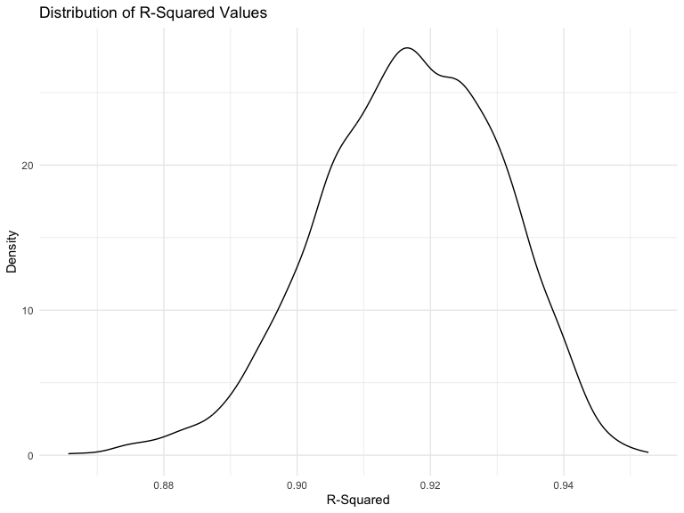
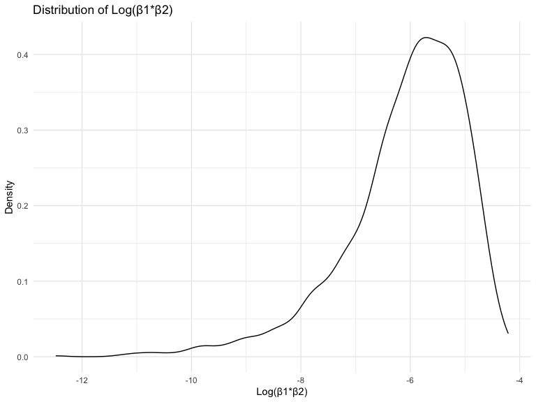
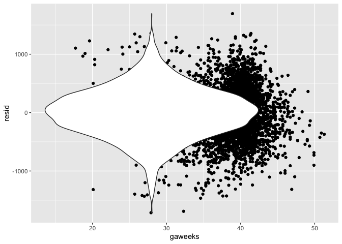
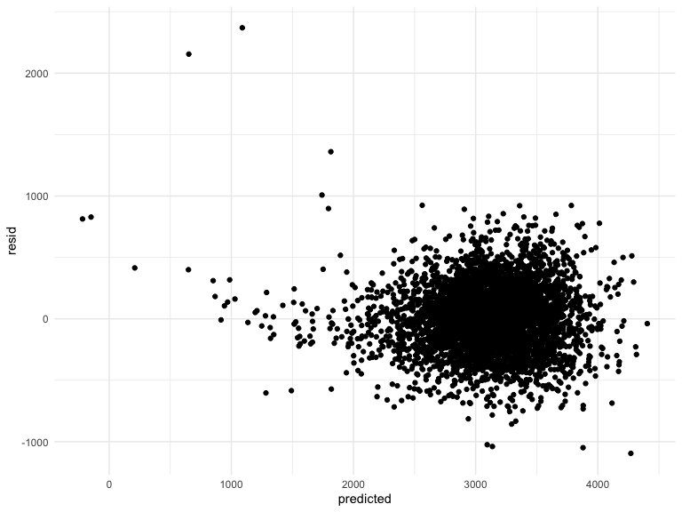

P8105 Homework 6
================
2023-11-24

## Library and Document-Wide Settings Setup

Loading libraries and establishing some document-wide settings for later
use.

!!! CHECK THAT DON’T HAVE UNNECESSARY LIBRARIES !!!!!

``` r
library(tidyverse)
```

    ## ── Attaching core tidyverse packages ──────────────────────── tidyverse 2.0.0 ──
    ## ✔ dplyr     1.1.3     ✔ readr     2.1.4
    ## ✔ forcats   1.0.0     ✔ stringr   1.5.0
    ## ✔ ggplot2   3.4.3     ✔ tibble    3.2.1
    ## ✔ lubridate 1.9.3     ✔ tidyr     1.3.0
    ## ✔ purrr     1.0.2     
    ## ── Conflicts ────────────────────────────────────────── tidyverse_conflicts() ──
    ## ✖ dplyr::filter() masks stats::filter()
    ## ✖ dplyr::lag()    masks stats::lag()
    ## ℹ Use the conflicted package (<http://conflicted.r-lib.org/>) to force all conflicts to become errors

``` r
library(modelr)
library(mgcv)
```

    ## Loading required package: nlme
    ## 
    ## Attaching package: 'nlme'
    ## 
    ## The following object is masked from 'package:dplyr':
    ## 
    ##     collapse
    ## 
    ## This is mgcv 1.9-0. For overview type 'help("mgcv-package")'.

``` r
library(viridis)
```

    ## Loading required package: viridisLite

# Problem 2

## Importing Central Park Weather Data

First, I’m importing the weather data for Central Park.

``` r
weather = 
  rnoaa::meteo_pull_monitors(
    c("USW00094728"),
    var = c("PRCP", "TMIN", "TMAX"), 
    date_min = "2022-01-01",
    date_max = "2022-12-31") |>
  mutate(
    name = recode(id, USW00094728 = "CentralPark_NY"),
    tmin = tmin / 10,
    tmax = tmax / 10) |>
  select(name, id, everything())
```

    ## using cached file: /Users/EmilyMurphy/Library/Caches/org.R-project.R/R/rnoaa/noaa_ghcnd/USW00094728.dly

    ## date created (size, mb): 2023-09-29 15:32:29.663439 (8.525)

    ## file min/max dates: 1869-01-01 / 2023-09-30

## Generating Linear Models Then Calculating R-Square and Log(Beta_1\*Beta_2)

Next, I’m generating 5000 bootstrap samples and fitting a linear
regression model to each, using `tmax` as the response with `tmin` and
`prcp` as the predictors. Then, with the linear model generated for each
sample, I’m pulling out only the `r_squared` and `log(beta_1*beta_2)`
values.

!!!! IS THERE A BETTER WAY TO CREATE THE LOG PRODUCT VARIABLE AND ALSO
KEEP THE R-SQUARED VARIABLE?

``` r
boot_straps = 
  weather |> 
  modelr::bootstrap(n = 5000) |> 
  mutate(
    models = map(strap, \(df) lm(tmax ~ tmin + prcp, data = df)),
    term_results = map(models, broom::tidy),
    glance_results = map(models, broom::glance)
  ) |> 
  unnest(term_results) |> 
  select(.id, term, estimate, glance_results) |> 
  unnest(glance_results) |> 
  janitor::clean_names() |> 
  select(id:r_squared) |> 
  group_by(id) |> 
  summarize(
    log_product = log(estimate[2]) + log(estimate[3]),
    r_squared = r_squared
  ) |> 
  distinct()
```

    ## `summarise()` has grouped output by 'id'. You can override using the `.groups`
    ## argument.

## Plotting the Distribution of the Estimates

``` r
boot_straps |> 
  ggplot(aes(x = r_squared)) +
  geom_density() + 
  labs(
    title = "Distribution of R-Squared Values",
    x = "R-Squared",
    y = "Density"
  )
```



``` r
boot_straps |> 
  ggplot(aes(x = log_product)) +
  geom_density() + 
  labs(
    title = "Distribution of Log(β1*β2)",
    x = "Log(β1*β2)",
    y = "Density"
  )
```



The distribution of the r-squared value is slightly left skewed, with
the most common r-squared value landing at just above 0.92. The vast
majority of r-squared values appear to fall between approximately 0.88
and 0.95. As a value of 1 would indicate that 100% of the variance in
maximum temperature is explained by the model, this distribution of
r-squared values suggests that the model using minimum temperature and
precipitation does a fairly solid job of predicting the maximum
temperature.

!!!!!! DESCRIBE THE LOG(B1\*B2) GRAPH IN WORDS ALSO TALK ABOUT THE
PROPORTION OF SAMPLES THAT HAD AN NAN VALUE, AND THAT THE DISTRIBUTION
DOESN’T INCLUDE THOSE NAs ALSO UPDATE R-HAT AND BETA VALUES TO USE THE
ACTUAL SYMBOLS (GOOGLE HOW TO DO THIS IN R MARKDOWN)

## Generating 95% Confidence Intervals

I can use the estimates across my 5000 bootstrap samples to construct a
95% confidence interval for r-squared and log(beta_1\*beta_2). To do so,
I need to identify the upper and lower 2.5% of the distribution for each
across all of the samples.

95% CI for r-squared: (0.8885, 0.9407).  
95% CI for log(beta_1\*beta_2): (-8.9816, -4.6017).

# Problem 3

## Importing and Cleaning the Birthweight Data Set

Loading and cleaning the `birthweight` dataset in preparation for
regression analysis. Specifically:

- Converting the `babysex`, `malform`, `frace`, and `mrace` variables to
  factors
- Although the `pnumlbw` and `pnumgsa` variables both have a value of 0
  for all observations, not dropping them as I’m not certain that this
  actually indicates missingness as opposed to an accurate value of 0

``` r
birthweight = 
  read_csv("Data/birthweight.csv") |> 
  as_tibble() |> 
  janitor::clean_names() |> 
  mutate(
    babysex = as.factor(case_match(babysex,
                                   1 ~ "Male",
                                   2 ~ "Female")),
    malform = as.factor(case_match(malform,
                                   0 ~ "Absent",
                                   1 ~"Present")),
    frace = as.factor(case_match(frace,
                                 1 ~ "White",
                                 2 ~ "Black",
                                 3 ~ "Asian",
                                 4 ~ "Puerto Rican",
                                 8 ~ "Other",
                                 9 ~ "")),
    mrace = as.factor(case_match(mrace,
                                 1 ~ "White",
                                 2 ~ "Black",
                                 3 ~ "Asian",
                                 4 ~ "Puerto Rican",
                                 8 ~ "Other",
                                 9 ~ "")),
    frace = fct_infreq(frace),
    mrace = fct_infreq(mrace)
  ) |> 
  select(bwt, everything())
```

    ## Rows: 4342 Columns: 20
    ## ── Column specification ────────────────────────────────────────────────────────
    ## Delimiter: ","
    ## dbl (20): babysex, bhead, blength, bwt, delwt, fincome, frace, gaweeks, malf...
    ## 
    ## ℹ Use `spec()` to retrieve the full column specification for this data.
    ## ℹ Specify the column types or set `show_col_types = FALSE` to quiet this message.

``` r
birthweight |> 
  group_by(mrace) |> 
  summarize(
    count = n()
  )
```

    ## # A tibble: 4 × 2
    ##   mrace        count
    ##   <fct>        <int>
    ## 1 White         2147
    ## 2 Black         1909
    ## 3 Puerto Rican   243
    ## 4 Asian           43

## Fitting a Birthweight Linear Regression Model

### Model 1: All Predictors

Based on information from the [Cleveland
Clinic](https://my.clevelandclinic.org/health/diseases/24980-low-birth-weight),
the following risk factors are likely predictors of birthweight:

- Preterm birth (variable: `gaweeks`)
- Being younger than 18 or older than 34 (variable: `momage`)
- Smoking during pregnancy (variable: `smoken`)
- Not gaining enough weight during pregnancy (variable: `wtgain`)
- Being Black (variable: `mrace`)

As a result, they will likely be in my final linear regression model.
But first, I’ll create an initial model with all of my non-birthweight
variables as predictors. I’ll then create a plot of the residuals
vs. predicted values.

``` r
fit_1 = 
  lm(
    bwt ~ babysex + bhead + blength + fincome + frace + gaweeks + malform 
    + menarche + mheight + momage + mrace + parity + pnumlbw + pnumsga + ppbmi 
    + ppwt + smoken + wtgain, 
    data = birthweight
  )

fit_1 |> 
  broom::tidy() |> 
  mutate(
    term = str_replace(term, "^mrace", "Mother's Race: "),
    term = str_replace(term, "^frace", "Father's Race: "),
    term = str_replace(term, "malform", "Malformation: "),
    term = str_replace(term, "babysex", "Baby Sex: ")
  ) |> 
  knitr::kable(digits = 3)
```

| term                        |  estimate | std.error | statistic | p.value |
|:----------------------------|----------:|----------:|----------:|--------:|
| (Intercept)                 | -6236.684 |   660.188 |    -9.447 |   0.000 |
| Baby Sex: Male              |   -28.707 |     8.465 |    -3.391 |   0.001 |
| bhead                       |   130.778 |     3.452 |    37.881 |   0.000 |
| blength                     |    74.954 |     2.022 |    37.075 |   0.000 |
| fincome                     |     0.290 |     0.180 |     1.614 |   0.107 |
| Father’s Race: Black        |    14.331 |    46.150 |     0.311 |   0.756 |
| Father’s Race: Puerto Rican |   -46.996 |    44.678 |    -1.052 |   0.293 |
| Father’s Race: Asian        |    21.236 |    69.296 |     0.306 |   0.759 |
| Father’s Race: Other        |     4.297 |    74.074 |     0.058 |   0.954 |
| gaweeks                     |    11.549 |     1.465 |     7.882 |   0.000 |
| Malformation: Present       |     9.765 |    70.626 |     0.138 |   0.890 |
| menarche                    |    -3.551 |     2.895 |    -1.226 |   0.220 |
| mheight                     |     9.787 |    10.312 |     0.949 |   0.343 |
| momage                      |     0.759 |     1.222 |     0.621 |   0.534 |
| Mother’s Race: Black        |  -151.435 |    46.045 |    -3.289 |   0.001 |
| Mother’s Race: Puerto Rican |   -56.479 |    45.137 |    -1.251 |   0.211 |
| Mother’s Race: Asian        |   -91.387 |    71.919 |    -1.271 |   0.204 |
| parity                      |    95.541 |    40.479 |     2.360 |   0.018 |
| pnumlbw                     |        NA |        NA |        NA |      NA |
| pnumsga                     |        NA |        NA |        NA |      NA |
| ppbmi                       |     4.354 |    14.891 |     0.292 |   0.770 |
| ppwt                        |     0.629 |     2.583 |     0.244 |   0.808 |
| smoken                      |    -4.854 |     0.587 |    -8.269 |   0.000 |
| wtgain                      |     4.101 |     0.395 |    10.386 |   0.000 |

``` r
birthweight |> 
  modelr::add_residuals(fit_1) |> 
  mutate(
    predicted = predict(fit_1)
  ) |> 
  filter(resid < 1000) |> 
  ggplot(aes(x = predicted, y = resid)) + 
  geom_point()
```



From the residuals plot, we can see that while the residuals are
generally randomly scattered around zero for predicted birthweight
values above approximately 2000 grams, the residuals for birthweights
lower than 2000 grams display a problematically-linear distribution.

From the table displaying the beta estimates for the predictors, we can
see that the the indicator with the highest p-value is Father’s Race:
Other, indicating that it’s an insignificant predictor of birthweight.
In fact, the p-values for all father’s race categories, compared to the
reference race, are quite large and insignificant. Additionally, because
the `pnumlbw` and `pnumsga` variables have values of 0 for all
observations, they have incalculable beta estimates and p-values. So,
for my next model, I will drop these 3 variables.

### Model 2: Dropping `frace`, `pnumlbw`, `pnumsga`, and Dichotomizing Mother’s Race

I noticed in the output table from the original model that there’s a
clear division in the significance of mother’s race, with Black having a
significant p-value of 0.001, while Puerto Rican has a p-value of 0.211
and Asian has a p-value of 0.204. Because of this, I will recode
mother’s race into a dichotomous variable of Black/Other Races and use
this dichotomized version going forward.

``` r
birthweight_updated = 
  birthweight |> 
  mutate(
    mrace = as.factor(if_else(as.character(mrace) == "Black", "Black", "Other")),
    mrace = fct_infreq(mrace)
  )
```

Now, as stated above, I will drop `frace`, `pnumlbw`, and `pnumsga` from
this model.

``` r
fit_2 = 
  lm(
    bwt ~ babysex + bhead + blength + fincome + gaweeks + malform + menarche 
    + mheight + momage + mrace + parity + ppbmi + ppwt + smoken + wtgain, 
    data = birthweight_updated
  )

fit_2 |> 
  broom::tidy() |> 
  mutate(
    term = str_replace(term, "^mrace", "Mother's Race: "),
    term = str_replace(term, "malform", "Malformation: "),
    term = str_replace(term, "babysex", "Baby Sex: ")
  ) |> 
  knitr::kable(digits = 3)
```

| term                  |  estimate | std.error | statistic | p.value |
|:----------------------|----------:|----------:|----------:|--------:|
| (Intercept)           | -6555.351 |   659.069 |    -9.946 |   0.000 |
| Baby Sex: Male        |   -27.287 |     8.480 |    -3.218 |   0.001 |
| bhead                 |   130.086 |     3.457 |    37.625 |   0.000 |
| blength               |    75.285 |     2.025 |    37.172 |   0.000 |
| fincome               |     0.426 |     0.178 |     2.395 |   0.017 |
| gaweeks               |    11.898 |     1.468 |     8.106 |   0.000 |
| Malformation: Present |    18.321 |    70.799 |     0.259 |   0.796 |
| menarche              |    -4.270 |     2.897 |    -1.474 |   0.141 |
| mheight               |    14.428 |    10.298 |     1.401 |   0.161 |
| momage                |     0.909 |     1.213 |     0.749 |   0.454 |
| Mother’s Race: Black  |  -121.269 |     9.792 |   -12.385 |   0.000 |
| parity                |    98.858 |    40.584 |     2.436 |   0.015 |
| ppbmi                 |     8.400 |    14.899 |     0.564 |   0.573 |
| ppwt                  |    -0.073 |     2.585 |    -0.028 |   0.978 |
| smoken                |    -4.499 |     0.584 |    -7.702 |   0.000 |
| wtgain                |     4.132 |     0.396 |    10.443 |   0.000 |

``` r
birthweight_updated |> 
  modelr::add_residuals(fit_2) |> 
  mutate(
    predicted = predict(fit_2)
  ) |> 
  ggplot(aes(x = predicted, y = resid)) + 
  geom_point()
```



``` r
fit_2 |> 
  broom::glance()
```

    ## # A tibble: 1 × 12
    ##   r.squared adj.r.squared sigma statistic p.value    df  logLik    AIC    BIC
    ##       <dbl>         <dbl> <dbl>     <dbl>   <dbl> <dbl>   <dbl>  <dbl>  <dbl>
    ## 1     0.716         0.715  273.      728.       0    15 -30513. 61060. 61168.
    ## # ℹ 3 more variables: deviance <dbl>, df.residual <int>, nobs <int>

From the residuals plot, we can see that it looks quite similar to the
prior model, with residuals being randomly scattered around 0 except for
predicted birthweights of less than 2000 grams.

From the table displaying the beta estimates for the predictors, we can
see that the the indicator with the highest p-value is Father’s Race:
Other, indicating that it’s an insignificant predictor of birthweight.
In fact, the p-values for all father’s race categories, compared to the
reference race, are quite large and insignificant. Additionally, because
the `pnumlbw` and `pnumsga` variables have values of 0 for all
observations, they have incalculable beta estimates and p-values. So,
for my next model, I will drop these 3 variables.

Start with the full model (with every predictor), then incrementally
drop the least significant predictor. After each drop, rerun the new
slimmed down model and look at the plot of the residuals.

Propose a regression model for birthweight. This model may be based on a
hypothesized structure for the factors that underly birthweight, on a
data-driven model-building process, or a combination of the two.
Describe your modeling process and show a plot of model residuals
against fitted values – use add_predictions and add_residuals in making
this plot.
