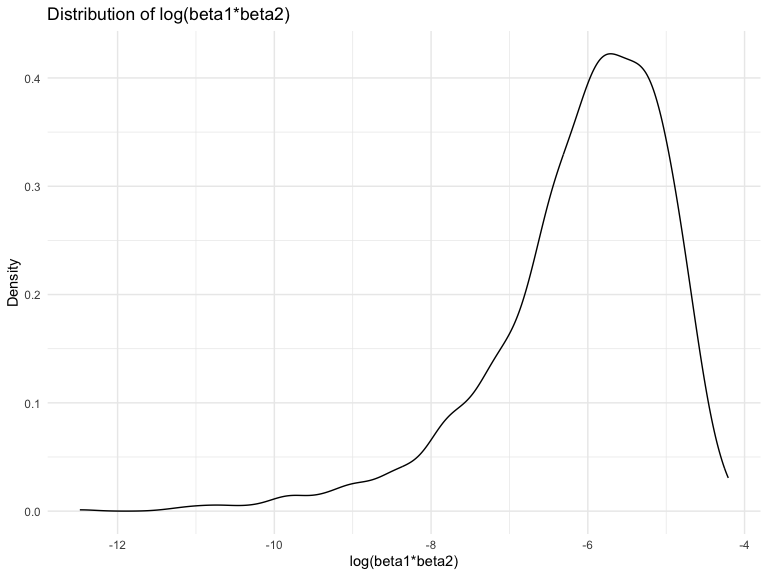

P8105 Homework 6
================
2023-11-24

## Library and Document-Wide Settings Setup

Loading libraries and establishing some document-wide settings for later
use.

# Problem 1

Didn’t attempt this time as it’s a busy week approaching finals, but
copying in the provided solution for future reference:

In the data cleaning code below we create a `city_state` variable,
change `victim_age` to numeric, modifiy victim_race to have categories
white and non-white, with white as the reference category, and create a
`resolution` variable indicating whether the homicide is solved. Lastly,
we filtered out the following cities: Tulsa, AL; Dallas, TX; Phoenix,
AZ; and Kansas City, MO; and we retained only the variables
`city_state`, `resolution`, `victim_age`, `victim_sex`, and
`victim_race`.

``` r
homicide_df = 
  read_csv("data/homicide-data.csv", na = c("", "NA", "Unknown")) |> 
  mutate(
    city_state = str_c(city, state, sep = ", "),
    victim_age = as.numeric(victim_age),
    resolution = case_when(
      disposition == "Closed without arrest" ~ 0,
      disposition == "Open/No arrest"        ~ 0,
      disposition == "Closed by arrest"      ~ 1)
  ) |> 
  filter(victim_race %in% c("White", "Black")) |> 
  filter(!(city_state %in% c("Tulsa, AL", "Dallas, TX", "Phoenix, AZ", "Kansas City, MO"))) |> 
  select(city_state, resolution, victim_age, victim_sex, victim_race)
```

    ## Rows: 52179 Columns: 12
    ## ── Column specification ────────────────────────────────────────────────────────
    ## Delimiter: ","
    ## chr (8): uid, victim_last, victim_first, victim_race, victim_sex, city, stat...
    ## dbl (4): reported_date, victim_age, lat, lon
    ## 
    ## ℹ Use `spec()` to retrieve the full column specification for this data.
    ## ℹ Specify the column types or set `show_col_types = FALSE` to quiet this message.

Next we fit a logistic regression model using only data from Baltimore,
MD. We model `resolved` as the outcome and `victim_age`, `victim_sex`,
and `victim_race` as predictors. We save the output as `baltimore_glm`
so that we can apply `broom::tidy` to this object and obtain the
estimate and confidence interval of the adjusted odds ratio for solving
homicides comparing non-white victims to white victims.

``` r
baltimore_glm = 
  filter(homicide_df, city_state == "Baltimore, MD") |> 
  glm(resolution ~ victim_age + victim_sex + victim_race, family = binomial(), data = _)

baltimore_glm |> 
  broom::tidy() |> 
  mutate(
    OR = exp(estimate), 
    OR_CI_upper = exp(estimate + 1.96 * std.error),
    OR_CI_lower = exp(estimate - 1.96 * std.error)) |> 
  filter(term == "victim_sexMale") |> 
  select(OR, OR_CI_lower, OR_CI_upper) |>
  knitr::kable(digits = 3)
```

|    OR | OR_CI_lower | OR_CI_upper |
|------:|------------:|------------:|
| 0.426 |       0.325 |       0.558 |

Below, by incorporating `nest()`, `map()`, and `unnest()` into the
preceding Baltimore-specific code, we fit a model for each of the
cities, and extract the adjusted odds ratio (and CI) for solving
homicides comparing non-white victims to white victims. We show the
first 5 rows of the resulting dataframe of model results.

``` r
model_results = 
  homicide_df |> 
  nest(data = -city_state) |> 
  mutate(
    models = map(data, \(df) glm(resolution ~ victim_age + victim_sex + victim_race, 
                             family = binomial(), data = df)),
    tidy_models = map(models, broom::tidy)) |> 
  select(-models, -data) |> 
  unnest(cols = tidy_models) |> 
  mutate(
    OR = exp(estimate), 
    OR_CI_upper = exp(estimate + 1.96 * std.error),
    OR_CI_lower = exp(estimate - 1.96 * std.error)) |> 
  filter(term == "victim_sexMale") |> 
  select(city_state, OR, OR_CI_lower, OR_CI_upper)

model_results |>
  slice(1:5) |> 
  knitr::kable(digits = 3)
```

| city_state      |    OR | OR_CI_lower | OR_CI_upper |
|:----------------|------:|------------:|------------:|
| Albuquerque, NM | 1.767 |       0.831 |       3.761 |
| Atlanta, GA     | 1.000 |       0.684 |       1.463 |
| Baltimore, MD   | 0.426 |       0.325 |       0.558 |
| Baton Rouge, LA | 0.381 |       0.209 |       0.695 |
| Birmingham, AL  | 0.870 |       0.574 |       1.318 |

Below we generate a plot of the estimated ORs and CIs for each city,
ordered by magnitude of the OR from smallest to largest. From this plot
we see that most cities have odds ratios that are smaller than 1,
suggesting that crimes with male victims have smaller odds of resolution
compared to crimes with female victims after adjusting for victim age
and race. This disparity is strongest in New York. In roughly half of
these cities, confidence intervals are narrow and do not contain 1,
suggesting a significant difference in resolution rates by sex after
adjustment for victim age and race.

``` r
model_results |> 
  mutate(
    city_state = fct_reorder(city_state, OR)
  ) |> 
  ggplot(aes(x = city_state, y = OR)) + 
  geom_point() + 
  geom_errorbar(aes(ymin = OR_CI_lower, ymax = OR_CI_upper)) + 
  theme(axis.text.x = element_text(angle = 90, hjust = 1))
```


# Problem 2

## Importing Central Park Weather Data

First, I’m importing the weather data for Central Park for the calendar
year of 2022. As part of the initial data cleaning process, I’m creating
a new `name` variable to identify the location as Central Park, dividing
the `tmin` and `tmax` values by a factor of 10, and reorganizing the
columns so that `name` and `id` come first.

``` r
weather = 
  rnoaa::meteo_pull_monitors(
    c("USW00094728"),
    var = c("PRCP", "TMIN", "TMAX"), 
    date_min = "2022-01-01",
    date_max = "2022-12-31") |>
  mutate(
    name = recode(id, USW00094728 = "CentralPark_NY"),
    tmin = tmin / 10,
    tmax = tmax / 10) |>
  select(name, id, everything())
```

    ## using cached file: /Users/EmilyMurphy/Library/Caches/org.R-project.R/R/rnoaa/noaa_ghcnd/USW00094728.dly

    ## date created (size, mb): 2023-09-29 15:32:29.663439 (8.525)

    ## file min/max dates: 1869-01-01 / 2023-09-30

## Generating Linear Models and Calculating Quantities

Next, I’m generating 5000 bootstrap samples and fitting a linear
regression model to each, using `tmax` as the response with `tmin` and
`prcp` as the predictors. Then, with the linear model generated for each
sample, I’m using a combination of `broom::tidy` and `broom::glance`,
followed by a bit of logarithmic algebra, to get the $r^{2}$ and
log($\beta_1$\*$\beta_2$) values.

``` r
boot_straps = 
  weather |> 
  modelr::bootstrap(n = 5000) |> 
  mutate(
    models = map(strap, \(df) lm(tmax ~ tmin + prcp, data = df)),
    term_results = map(models, broom::tidy),
    glance_results = map(models, broom::glance)
  ) |> 
  unnest(term_results) |> 
  select(.id, term, estimate, glance_results) |> 
  unnest(glance_results) |> 
  janitor::clean_names() |> 
  select(id:r_squared) |> 
  group_by(id) |> 
  summarize(
    log_product = log(estimate[2]) + log(estimate[3]),
    r_squared = r_squared
  ) |> 
  distinct()
```

    ## `summarise()` has grouped output by 'id'. You can override using the `.groups`
    ## argument.

## Plotting Distributions of the Estimates

To get a sense of what the distribution of $r^{2}$ and
log($\hat{\beta}_1$\*$\hat{\beta}_2$) look like across the entire
collection of our bootstrapped samples, I’m creating a density plot for
each.

``` r
boot_straps |> 
  ggplot(aes(x = r_squared)) +
  geom_density() + 
  labs(
    title = "Distribution of R-Squared Values",
    x = "R-Squared",
    y = "Density"
  )
```


``` r
boot_straps |> 
  ggplot(aes(x = log_product)) +
  geom_density() + 
  labs(
    title = "Distribution of log(beta1*beta2)",
    x = "log(beta1*beta2)",
    y = "Density"
  )
```



The distribution of $r^{2}$ values is slightly left skewed, with the
most common value landing at just above 0.92. The vast majority of
$r^{2}$ values appear to fall between approximately 0.88 and 0.95. As a
value of 1 would indicate that 100% of the variance in maximum
temperature is explained by the model, this distribution of $r^{2}$
values suggests that the model using minimum temperature and
precipitation does a fairly solid job of predicting the maximum
temperature.

In comparison, the distribution of the log($\beta_1$*$\beta_2$) values
is much more noticeably left skewed, with a significant trail extending
out to the left. The most common values for log($\beta_1$*$\beta_2$)
seem to be between -6 and -5, although some values are as low as -12.
It’s important note that this plot only includes samples with a
calculable numeric value for log($\beta_1$*$\beta_2$). As more than 2/3
(0.6722) of the bootstrapped samples had NA values for
log($\beta_1$*$\beta_2$) (because either its $\beta_1$ or $\beta_2$ was
negative), this means that the distribution plot leaves out more than
half of all of the samples.

## Generating 95% Confidence Intervals

I can use the estimates across my 5000 bootstrap samples to construct a
95% confidence interval for $r^{2}$ and log($\beta_1$\*$\beta_2$). To do
so, I need to identify the upper and lower 2.5% of the distribution for
each across all of the samples.

95% CI for $r^{2}$: (0.8885, 0.9407).  
95% CI for log($\beta_1$\*$\beta_2$): (-8.9816, -4.6017).

# Problem 3

## Importing and Cleaning the Birthweight Data Set

To start, I’ll load and clean the `birthweight` dataset in preparation
for regression analysis. Specifically, this involves:

- Converting the `babysex`, `malform`, `frace`, and `mrace` variables to
  factors
- Setting the most common frequent race in the dataset (white) to be the
  reference level for the `frace` and `mrace` variables
- Rearranging the columns so that `bwt` is first

Note: Although the `pnumlbw` and `pnumgsa` variables both have a value
of 0 for all observations, I’m not dropping the variables entirely as
I’m not completely certain that 0 indicates missingness.

``` r
birthweight = 
  read_csv("Data/birthweight.csv") |> 
  as_tibble() |> 
  janitor::clean_names() |> 
  mutate(
    babysex = as.factor(case_match(babysex,
                                   1 ~ "Male",
                                   2 ~ "Female")),
    malform = as.factor(case_match(malform,
                                   0 ~ "Absent",
                                   1 ~"Present")),
    frace = as.factor(case_match(frace,
                                 1 ~ "White",
                                 2 ~ "Black",
                                 3 ~ "Asian",
                                 4 ~ "Puerto Rican",
                                 8 ~ "Other",
                                 9 ~ "")),
    mrace = as.factor(case_match(mrace,
                                 1 ~ "White",
                                 2 ~ "Black",
                                 3 ~ "Asian",
                                 4 ~ "Puerto Rican",
                                 8 ~ "Other",
                                 9 ~ "")),
    frace = fct_infreq(frace),
    mrace = fct_infreq(mrace)
  ) |> 
  select(bwt, everything())
```

    ## Rows: 4342 Columns: 20
    ## ── Column specification ────────────────────────────────────────────────────────
    ## Delimiter: ","
    ## dbl (20): babysex, bhead, blength, bwt, delwt, fincome, frace, gaweeks, malf...
    ## 
    ## ℹ Use `spec()` to retrieve the full column specification for this data.
    ## ℹ Specify the column types or set `show_col_types = FALSE` to quiet this message.

## Fitting a Birthweight Linear Regression Model

### Model 1: All Predictors

To begin with trying to create a linear model that accurately predicts a
baby’s birthweight, I’ll first make an initial model with all of my
non-birthweight variables as predictors (a full model). The beta
estimates for each predictor variable and the estimate’s associated
p-value will be displayed in a table.

``` r
fit_1 = 
  lm(
    bwt ~ babysex + bhead + blength + fincome + frace + gaweeks + malform 
    + menarche + mheight + momage + mrace + parity + pnumlbw + pnumsga + ppbmi 
    + ppwt + smoken + wtgain, 
    data = birthweight
  )

fit_1 |> 
  broom::tidy() |> 
  mutate(
    term = str_replace(term, "^mrace", "Mother's Race: "),
    term = str_replace(term, "^frace", "Father's Race: "),
    term = str_replace(term, "malform", "Malformation: "),
    term = str_replace(term, "babysex", "Baby Sex: ")
  ) |> 
  knitr::kable(digits = 3)
```

| term                        |  estimate | std.error | statistic | p.value |
|:----------------------------|----------:|----------:|----------:|--------:|
| (Intercept)                 | -6236.684 |   660.188 |    -9.447 |   0.000 |
| Baby Sex: Male              |   -28.707 |     8.465 |    -3.391 |   0.001 |
| bhead                       |   130.778 |     3.452 |    37.881 |   0.000 |
| blength                     |    74.954 |     2.022 |    37.075 |   0.000 |
| fincome                     |     0.290 |     0.180 |     1.614 |   0.107 |
| Father’s Race: Black        |    14.331 |    46.150 |     0.311 |   0.756 |
| Father’s Race: Puerto Rican |   -46.996 |    44.678 |    -1.052 |   0.293 |
| Father’s Race: Asian        |    21.236 |    69.296 |     0.306 |   0.759 |
| Father’s Race: Other        |     4.297 |    74.074 |     0.058 |   0.954 |
| gaweeks                     |    11.549 |     1.465 |     7.882 |   0.000 |
| Malformation: Present       |     9.765 |    70.626 |     0.138 |   0.890 |
| menarche                    |    -3.551 |     2.895 |    -1.226 |   0.220 |
| mheight                     |     9.787 |    10.312 |     0.949 |   0.343 |
| momage                      |     0.759 |     1.222 |     0.621 |   0.534 |
| Mother’s Race: Black        |  -151.435 |    46.045 |    -3.289 |   0.001 |
| Mother’s Race: Puerto Rican |   -56.479 |    45.137 |    -1.251 |   0.211 |
| Mother’s Race: Asian        |   -91.387 |    71.919 |    -1.271 |   0.204 |
| parity                      |    95.541 |    40.479 |     2.360 |   0.018 |
| pnumlbw                     |        NA |        NA |        NA |      NA |
| pnumsga                     |        NA |        NA |        NA |      NA |
| ppbmi                       |     4.354 |    14.891 |     0.292 |   0.770 |
| ppwt                        |     0.629 |     2.583 |     0.244 |   0.808 |
| smoken                      |    -4.854 |     0.587 |    -8.269 |   0.000 |
| wtgain                      |     4.101 |     0.395 |    10.386 |   0.000 |

From the table, we can see that the the indicator with the highest
p-value is Father’s Race: Other, indicating that it likely isn’t very
predictive of a baby’s birthweight. In fact, the p-values for all
father’s race categories are quite large. As a result, I will remove the
`frace` variable from my model. Additionally, because the `pnumlbw` and
`pnumsga` variables have values of 0 for all observations, they have
incalculable beta estimates and p-values. So, I will drop them as well
from my next model.

### Model 2: Dropping `frace`, `pnumlbw`, `pnumsga`

Now, I’ll make a new model, but will remove `frace`, `pnumlbw`, and
`pnumsga` as predictors. As before, I’ll make a table of the beta
estimates and p-values from the updated model.

``` r
fit_2 = 
  lm(
    bwt ~ babysex + bhead + blength + fincome + gaweeks + malform + menarche 
    + mheight + momage + mrace + parity + ppbmi + ppwt + smoken + wtgain, 
    data = birthweight
  )

fit_2 |> 
  broom::tidy() |> 
  mutate(
    term = str_replace(term, "^mrace", "Mother's Race: "),
    term = str_replace(term, "malform", "Malformation: "),
    term = str_replace(term, "babysex", "Baby Sex: ")
  ) |> 
  knitr::kable(digits = 3)
```

| term                        |  estimate | std.error | statistic | p.value |
|:----------------------------|----------:|----------:|----------:|--------:|
| (Intercept)                 | -6247.076 |   659.893 |    -9.467 |   0.000 |
| Baby Sex: Male              |   -28.677 |     8.462 |    -3.389 |   0.001 |
| bhead                       |   130.796 |     3.450 |    37.914 |   0.000 |
| blength                     |    74.912 |     2.021 |    37.075 |   0.000 |
| fincome                     |     0.290 |     0.179 |     1.619 |   0.106 |
| gaweeks                     |    11.565 |     1.465 |     7.895 |   0.000 |
| Malformation: Present       |     9.860 |    70.604 |     0.140 |   0.889 |
| menarche                    |    -3.612 |     2.892 |    -1.249 |   0.212 |
| mheight                     |     9.975 |    10.307 |     0.968 |   0.333 |
| momage                      |     0.755 |     1.221 |     0.618 |   0.536 |
| Mother’s Race: Black        |  -137.203 |    10.215 |   -13.432 |   0.000 |
| Mother’s Race: Puerto Rican |   -99.158 |    19.386 |    -5.115 |   0.000 |
| Mother’s Race: Asian        |   -73.858 |    42.789 |    -1.726 |   0.084 |
| parity                      |    95.667 |    40.468 |     2.364 |   0.018 |
| ppbmi                       |     4.563 |    14.884 |     0.307 |   0.759 |
| ppwt                        |     0.592 |     2.581 |     0.229 |   0.819 |
| smoken                      |    -4.828 |     0.586 |    -8.239 |   0.000 |
| wtgain                      |     4.100 |     0.395 |    10.392 |   0.000 |

From looking at the p-values of the predictor terms in this second
model, it appears that `ppwt`, `malform`, `ppbmi`, and `momage` are now
the least significant predictors of birthweight, so I will remove those
variables from the next model.

### Model 3: Dropping `ppwt`, `malform`, `ppbmi`, and `momage`

Now dropping `ppwt`, `malform`, `ppbmi`, and `momage` from the model,
called `fit_3`.

``` r
fit_3 = 
  lm(
    bwt ~ babysex + bhead + blength + fincome + gaweeks + menarche + mheight 
    + mrace + parity + smoken + wtgain, 
    data = birthweight
  )

fit_3 |> 
  broom::tidy() |> 
  mutate(
    term = str_replace(term, "^mrace", "Mother's Race: "),
    term = str_replace(term, "babysex", "Baby Sex: ")
  ) |> 
  knitr::kable(digits = 3)
```

| term                        |  estimate | std.error | statistic | p.value |
|:----------------------------|----------:|----------:|----------:|--------:|
| (Intercept)                 | -6212.310 |   136.705 |   -45.443 |   0.000 |
| Baby Sex: Male              |   -29.071 |     8.488 |    -3.425 |   0.001 |
| bhead                       |   132.408 |     3.451 |    38.366 |   0.000 |
| blength                     |    75.580 |     2.024 |    37.334 |   0.000 |
| fincome                     |     0.318 |     0.175 |     1.815 |   0.070 |
| gaweeks                     |    11.670 |     1.468 |     7.950 |   0.000 |
| menarche                    |    -5.209 |     2.832 |    -1.840 |   0.066 |
| mheight                     |    11.317 |     1.645 |     6.882 |   0.000 |
| Mother’s Race: Black        |  -133.816 |     9.912 |   -13.500 |   0.000 |
| Mother’s Race: Puerto Rican |   -97.962 |    19.404 |    -5.049 |   0.000 |
| Mother’s Race: Asian        |   -90.749 |    42.465 |    -2.137 |   0.033 |
| parity                      |    97.668 |    40.507 |     2.411 |   0.016 |
| smoken                      |    -4.659 |     0.587 |    -7.933 |   0.000 |
| wtgain                      |     3.744 |     0.390 |     9.592 |   0.000 |

This model looks pretty good, as nearly every predictor is significant
(\< 0.05). In the interest of having a final model that is as simple as
possible, I will do one last removal of the remaining predictors with
the highest p-values: `babysex`, `menarche`, `fincome`, and `parity`.

#### Model 4: Dropping `babysex`, `menarche`, `fincome`, and `parity` and Evaluating Model Fit

Doing one last variable eliminiation from the model, dropping `babysex`,
`menarche`, `fincome`, and `parity`.

``` r
fit_4 = 
  lm(
    bwt ~ bhead + blength + gaweeks + mheight + mrace + smoken + wtgain, 
    data = birthweight
  )

fit_4 |> 
  broom::tidy() |> 
  mutate(
    term = str_replace(term, "^mrace", "Mother's Race: ")
  ) |> 
  knitr::kable(digits = 3)
```

| term                        |  estimate | std.error | statistic | p.value |
|:----------------------------|----------:|----------:|----------:|--------:|
| (Intercept)                 | -6235.023 |   133.870 |   -46.575 |   0.000 |
| bhead                       |   130.902 |     3.415 |    38.333 |   0.000 |
| blength                     |    75.330 |     2.026 |    37.183 |   0.000 |
| gaweeks                     |    11.954 |     1.459 |     8.193 |   0.000 |
| mheight                     |    11.510 |     1.634 |     7.044 |   0.000 |
| Mother’s Race: Black        |  -140.891 |     9.246 |   -15.239 |   0.000 |
| Mother’s Race: Puerto Rican |  -101.851 |    19.204 |    -5.304 |   0.000 |
| Mother’s Race: Asian        |  -103.496 |    42.387 |    -2.442 |   0.015 |
| smoken                      |    -4.806 |     0.588 |    -8.177 |   0.000 |
| wtgain                      |     3.767 |     0.391 |     9.647 |   0.000 |

In this final model, every predictor is statistically significant as all
p-values are \< 0.05. For a better sense of how well this final model
fits the data, I will use `broom::glance()` to evaluate $r^{2}$ for both
it and the original model that we started with.

``` r
fit_4 |> 
  broom::glance() |> 
  select(r.squared)
```

    ## # A tibble: 1 × 1
    ##   r.squared
    ##       <dbl>
    ## 1     0.714

``` r
fit_1 |> 
  broom::glance() |> 
  select(r.squared) 
```

    ## # A tibble: 1 × 1
    ##   r.squared
    ##       <dbl>
    ## 1     0.718

R-squared is the proportion of variance in birthweight that can be
explained by the included predictor variables (essentially, a test of
goodness of fit of the regression model). By comparing the $r^{2}$ value
from the initial comprehensive model (0.718) to the $r^{2}$ value from
the final model (0.714), we can see that together, the variables
`bhead`, `blength`, `gaweeks`, `mheight`, `mrace`, `smoken`, and
`wtgain` explain 71.4% of the variability in birthweight. Though
backward elimination, I removed 11 exposure variables, simplifying the
model, while only losing 0.4% of the model’s power to predict
birthweight.

Notably, the final model also aligns well with the [Cleveland
Clinic](https://my.clevelandclinic.org/health/diseases/24980-low-birth-weight)’s
list of risk factors for low birthweight, as their predictors include:

- Preterm birth (equivalent variable: `gaweeks`)
- Being younger than 18 or older than 34 (equivalent variable: `momage`)
- Smoking during pregnancy (equivalent variable: `smoken`)
- Not gaining enough weight during pregnancy (equivalent variable:
  `wtgain`)
- Being Black (equivalent variable: `mrace`)

## Plotting Fitted Values Against Model Residuals

With the final model, I can now calculate the predicted birthweight
value for every observation, as well as the associated residuals, and
then plot these two values against each other.

``` r
birthweight |> 
  modelr::add_residuals(fit_4) |> 
  mutate(
    predicted = predict(fit_4)
  ) |> 
  ggplot(aes(x = predicted, y = resid)) + 
  geom_point() + 
  labs(
    title = "Residuals from Final Model",
    x = "Predicted Birthweight (grams)",
    y = "Residual"
  )
```


From the residuals plot, we can see that while the residuals are
generally randomly scattered around 0 for predicted birthweight values
above approximately 1500 grams, the residuals for birthweights lower
than 1500 grams seem to move away from 0 in a semi-linear pattern. If I
decided that this pattern was substantial enough to be concerning, I
could use median regression, which is less sensitive to outliers, or
examine the extremely low birthweight values separately from the primary
analysis.

## Comparing Models

I’d now like to see how my final `fit_4` model holds up against two
others:

- One using length at birth and gestational age as predictors (main
  effects only)
- One using head circumference, length, sex, and all interactions

To test the model comparisons, I’ll generate 100 sets of training and
testing data to use for cross-validation, fit each model to the training
data, and then evaluate the root mean square error (RMSE) of the testing
data for each model. The RMSE measures the average distance between the
model’s predicted values and its actual sample values.

``` r
cross_val =
  crossv_mc(birthweight, 100) |> 
  mutate(
    train = map(train, as_tibble),
    test = map(test, as_tibble)
  )

cross_val =
  cross_val |> 
  mutate(
    my_mod = map(train, \(df) lm(bwt ~ bhead + blength + gaweeks + mheight + mrace + smoken + wtgain, data = df)),
    main_effects_mod = map(train, \(df) lm(bwt ~ blength + gaweeks, data = df)),
    interactions = map(train, \(df) lm(
      bwt ~ babysex + bhead + blength + babysex*bhead + babysex*blength + bhead*blength + babysex*bhead*blength, data = df))
  ) |> 
  mutate(
    rmse_mine = map2_dbl(my_mod, test, \(mod, df) rmse(model = mod, data = df)),
    rmse_main = map2_dbl(main_effects_mod, test, \(mod, df) rmse(model = mod, data = df)),
    rmse_interactions = map2_dbl(interactions, test, \(mod, df) rmse(model = mod, data = df))
  )
```

Finally, to compare the models, I will plot the distribution of each
one’s RMSE values.

``` r
cross_val |> 
  select(starts_with("rmse")) |> 
  pivot_longer(
    everything(),
    names_to = "model", 
    values_to = "rmse",
    names_prefix = "rmse_") |> 
  mutate(model = fct_inorder(model)) |> 
  ggplot(aes(x = model, y = rmse, color = model)) + 
  geom_violin() + 
  labs(
    title = "Distribution of RMSEs, By Model",
    x = "Model Tested",
    y = "Root Mean Square Error (RMSE) Value"
  )
```


From this plot, my model clearly wins against the main effect and
interaction models, as most of its RMSE values are concentrated at a
comparatively lower value. Between the main effect and interactions
models, the former performs far better than the latter.
