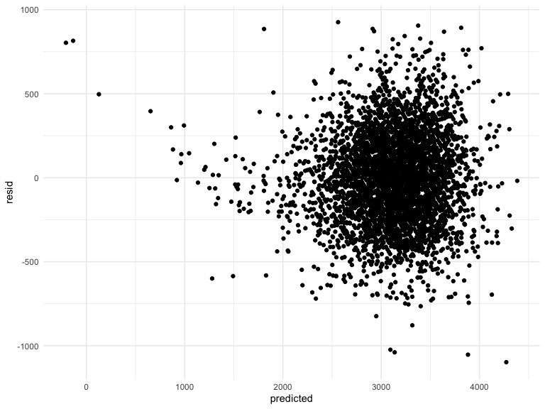
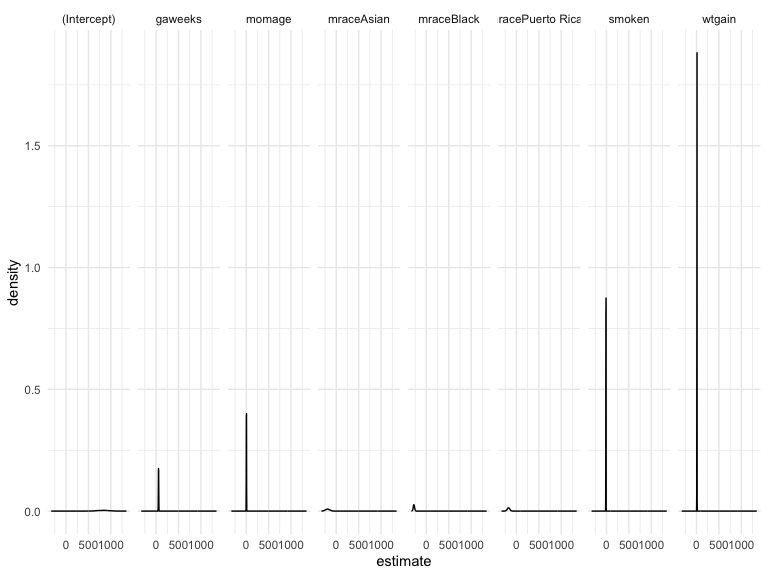

P8105 Homework 6
================
2023-11-24

## Library Setup

Loading the `tidyverse` library for later use.

``` r
library(tidyverse)
```

    ## ── Attaching core tidyverse packages ──────────────────────── tidyverse 2.0.0 ──
    ## ✔ dplyr     1.1.3     ✔ readr     2.1.4
    ## ✔ forcats   1.0.0     ✔ stringr   1.5.0
    ## ✔ ggplot2   3.4.3     ✔ tibble    3.2.1
    ## ✔ lubridate 1.9.3     ✔ tidyr     1.3.0
    ## ✔ purrr     1.0.2     
    ## ── Conflicts ────────────────────────────────────────── tidyverse_conflicts() ──
    ## ✖ dplyr::filter() masks stats::filter()
    ## ✖ dplyr::lag()    masks stats::lag()
    ## ℹ Use the conflicted package (<http://conflicted.r-lib.org/>) to force all conflicts to become errors

``` r
library(modelr)
library(mgcv)
```

    ## Loading required package: nlme
    ## 
    ## Attaching package: 'nlme'
    ## 
    ## The following object is masked from 'package:dplyr':
    ## 
    ##     collapse
    ## 
    ## This is mgcv 1.9-0. For overview type 'help("mgcv-package")'.

``` r
set.seed(1)
```

# Problem 2

## Importing Central Park Weather Data

First, I’m importing the weather data for Central Park.

``` r
weather = 
  rnoaa::meteo_pull_monitors(
    c("USW00094728"),
    var = c("PRCP", "TMIN", "TMAX"), 
    date_min = "2022-01-01",
    date_max = "2022-12-31") |>
  mutate(
    name = recode(id, USW00094728 = "CentralPark_NY"),
    tmin = tmin / 10,
    tmax = tmax / 10) |>
  select(name, id, everything())
```

    ## using cached file: /Users/EmilyMurphy/Library/Caches/org.R-project.R/R/rnoaa/noaa_ghcnd/USW00094728.dly

    ## date created (size, mb): 2023-09-29 15:32:29.663439 (8.525)

    ## file min/max dates: 1869-01-01 / 2023-09-30

Next, I’m

We’ll focus on a simple linear regression with tmax as the response with
tmin and prcp as the predictors, and are interested in the distribution
of two quantities estimated from these data:

r̂ 2 log(β̂ 1∗β̂ 2)

``` r
log_prod_results = 
  lm(tmax ~ tmin + prcp, data = weather) |> 
  broom::tidy() |> 
  slice(-1) |> 
  summarize(
    log_product = log(estimate[1]) + log(estimate[2])
  )
```

    ## Warning: There was 1 warning in `summarize()`.
    ## ℹ In argument: `log_product = log(estimate[1]) + log(estimate[2])`.
    ## Caused by warning in `log()`:
    ## ! NaNs produced

``` r
r_square_results = 
  lm(tmax ~ tmin + prcp, data = weather) |> 
  broom::glance() |> 
  select(r.squared) |> 
  janitor::clean_names()

strap_results = 
  bind_cols(log_prod_results, r_square_results)
```

!!!! IS THERE A BETTER WAY TO CREATE THE LOG PRODUCT VARIABLE AND ALSO
KEEP THE R-SQUARED VARIABLE?

``` r
boot_straps = 
  weather |> 
  modelr::bootstrap(n = 10) |> 
  mutate(
    models = map(strap, \(df) lm(tmax ~ tmin + prcp, data = df)),
    term_results = map(models, broom::tidy),
    glance_results = map(models, broom::glance)
  ) |> 
  unnest(term_results) |> 
  select(.id, term, estimate, glance_results) |> 
  unnest(glance_results) |> 
  janitor::clean_names() |> 
  select(id:r_squared) |> 
  group_by(id) |> 
  summarize(
    log_product = log(estimate[2]) + log(estimate[3]),
    r_squared = r_squared
  ) |> 
  distinct()
```

    ## Warning: There were 6 warnings in `summarize()`.
    ## The first warning was:
    ## ℹ In argument: `log_product = log(estimate[2]) + log(estimate[3])`.
    ## ℹ In group 2: `id = "02"`.
    ## Caused by warning in `log()`:
    ## ! NaNs produced
    ## ℹ Run `dplyr::last_dplyr_warnings()` to see the 5 remaining warnings.

    ## Warning: Returning more (or less) than 1 row per `summarise()` group was deprecated in
    ## dplyr 1.1.0.
    ## ℹ Please use `reframe()` instead.
    ## ℹ When switching from `summarise()` to `reframe()`, remember that `reframe()`
    ##   always returns an ungrouped data frame and adjust accordingly.
    ## Call `lifecycle::last_lifecycle_warnings()` to see where this warning was
    ## generated.

    ## `summarise()` has grouped output by 'id'. You can override using the `.groups`
    ## argument.

# Problem 3

## Importing and Cleaning the Birthweight Data Set

Loading and cleaning the `birthweight` dataset in preparation for
regression analysis. Specifically:

- Converting the `babysex`, `malform`, `frace`, and `mrace` variables to
  factors
- Although the `pnumlbw` and `pnumgsa` variables both have a value of 0
  for all observations, not dropping them as I’m not certain that this
  actually indicates missingness as opposed to an accurate value of 0
- Adding a binary `lbw` (low birthweight) with Yes/No values based on
  the baby’s birthweight (the `bwt` variable), using the [Cleveland
  Clinic’s cutoff
  value](https://my.clevelandclinic.org/health/diseases/24980-low-birth-weight)
  of 2,500 grams

``` r
birthweight = 
  read_csv("Data/birthweight.csv") |> 
  as_tibble() |> 
  janitor::clean_names() |> 
  mutate(
    babysex = as.factor(case_match(babysex,
                                   1 ~ "Male",
                                   2 ~ "Female")),
    malform = as.factor(case_match(malform,
                                   0 ~ "Absent",
                                   1 ~"Present")),
    frace = as.factor(case_match(frace,
                                 1 ~ "White",
                                 2 ~ "Black",
                                 3 ~ "Asian",
                                 4 ~ "Puerto Rican",
                                 8 ~ "Other",
                                 9 ~ "")),
    mrace = as.factor(case_match(mrace,
                                 1 ~ "White",
                                 2 ~ "Black",
                                 3 ~ "Asian",
                                 4 ~ "Puerto Rican",
                                 8 ~ "Other",
                                 9 ~ "")),
    frace = fct_infreq(frace),
    mrace = fct_infreq(mrace),
    lbw = as.factor(if_else(bwt < 2500, "Yes", "No"))
  )
```

    ## Rows: 4342 Columns: 20
    ## ── Column specification ────────────────────────────────────────────────────────
    ## Delimiter: ","
    ## dbl (20): babysex, bhead, blength, bwt, delwt, fincome, frace, gaweeks, malf...
    ## 
    ## ℹ Use `spec()` to retrieve the full column specification for this data.
    ## ℹ Specify the column types or set `show_col_types = FALSE` to quiet this message.

## Fitting a Birthweight Linear Regression Model

Now, I’d like to build a linear regression model for birthweight. Based
on information from the Cleveland Clinic, the following risk factors are
likely predictors of birthweight:

- Preterm birth (variable: `gaweeks`)
- Being younger than 18 or older than 34 (variable: `momage`)
- Smoking during pregnancy (variable: `smoken`)
- Not gaining enough weight during pregnancy (variable: `wtgain`)
- Being Black (variable: `mrace`)

First, I’ll build an initial model using these hypothesized factors,
then tidy the results and save to a dataframe called `fit_1`.

``` r
bwt_fit = 
  lm(bwt ~ gaweeks + momage + smoken + wtgain + mrace, data = birthweight) 

bwt_fit |> 
  broom::tidy() |> 
  mutate(
    term = str_replace(term, "^mrace", "Race: ")
  ) |> 
  select(term, estimate, p.value) |> 
  knitr::kable(digits = 3)
```

| term               | estimate | p.value |
|:-------------------|---------:|--------:|
| (Intercept)        |  833.745 |   0.000 |
| gaweeks            |   54.449 |   0.000 |
| momage             |    5.209 |   0.005 |
| smoken             |  -11.230 |   0.000 |
| wtgain             |    9.421 |   0.000 |
| Race: Black        | -276.632 |   0.000 |
| Race: Puerto Rican | -174.590 |   0.000 |
| Race: Asian        | -191.175 |   0.005 |

All of the p-values for the included covariates are \<0.05, indicating
statistical significance.

## Examining Residuals

To check the fit of the model, I’ll now examine the residuals

!!!!!!! WHAT SHAPE SHOULD THE RESIDUALS MAKE? !!!!!!!!!

``` r
birthweight |> 
  modelr::add_residuals(bwt_fit) |> 
  ggplot(aes(x = gaweeks, y = resid)) + 
  geom_point() + 
  geom_violin(aes(x = momage, y = resid))
```

<!-- -->

## Bootstrapping

``` r
birthweight |> 
  modelr::bootstrap(n = 1000) |> 
  mutate(
    models = map(strap, \(df) lm(bwt ~ gaweeks + momage + smoken + wtgain + mrace, data = df)),
    results = map(models, broom::tidy)
  ) |> 
  select(results) |> 
  unnest(results) |> 
  group_by(term) |> 
  ggplot(aes(x = estimate)) + geom_density() + facet_grid(. ~ term)
```

<!-- -->

Propose a regression model for birthweight. This model may be based on a
hypothesized structure for the factors that underly birthweight, on a
data-driven model-building process, or a combination of the two.
Describe your modeling process and show a plot of model residuals
against fitted values – use add_predictions and add_residuals in making
this plot.
